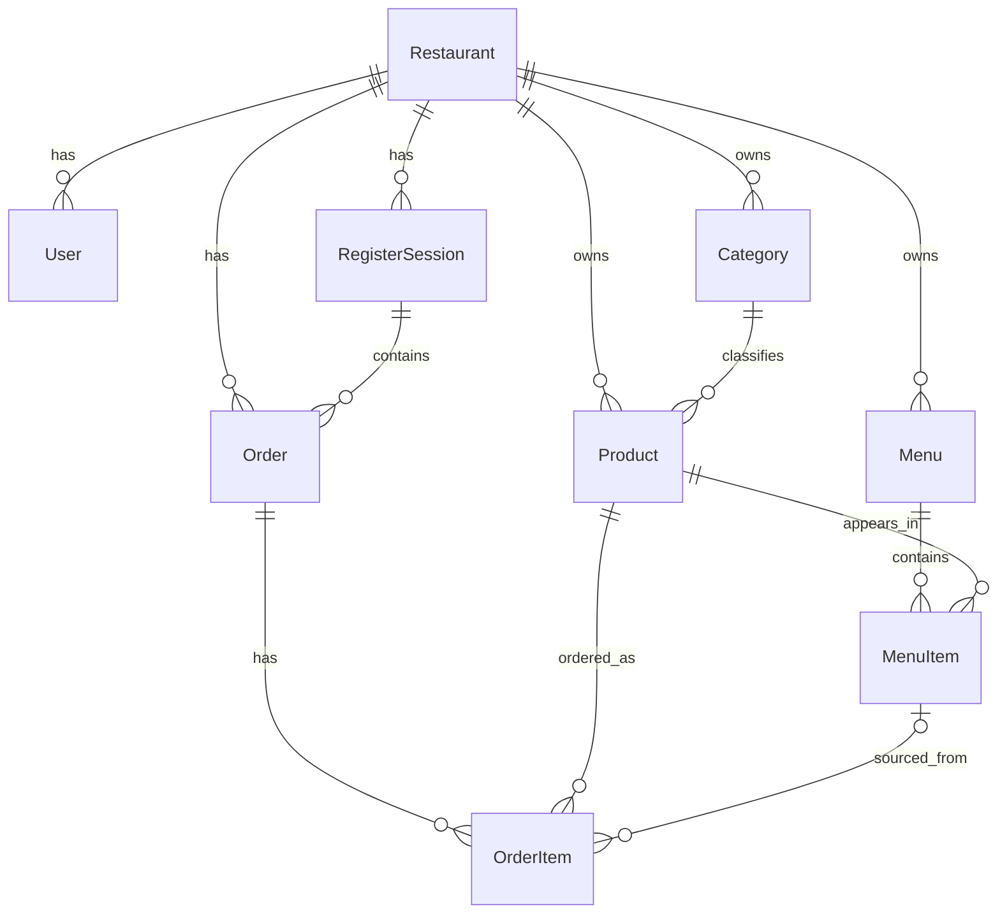

# Database — restaurants-api (example)

POS domain for a restaurant. Tracks menus, products, orders, and cash register sessions.

## Models

### 8. Order
Represents a customer order within a register session.
*   **id**: Unique UUID.
*   **orderNumber**: Sequential order number within the session.
*   **status**: Order status (CREATED, PROCESSING, PAID, COMPLETED).
*   **paymentMethod**: Payment method (nullable: set when order is paid. Values: CARD, CASH, DIGITAL_WALLET).
*   **customerEmail**: Customer email for receipt (nullable).
*   **totalAmount**: Total order amount (Decimal).
*   **restaurantId**: Foreign key to `Restaurant` (required).
*   **registerSessionId**: Foreign key to `RegisterSession` (required).

### 9. OrderItem
Individual line item within an order.
*   **id**: Unique UUID.
*   **quantity**: Number of units ordered.
*   **unitPrice**: Price per unit at time of order.
*   **subtotal**: quantity * unitPrice.
*   **notes**: Special instructions (nullable).
*   **orderId**: Foreign key to `Order` (required, cascade delete).
*   **productId**: Foreign key to `Product` (required).
*   **menuItemId**: Foreign key to `MenuItem` (nullable: null when product is ordered directly without a menu).

### 10. RegisterSession
Represents a cash register session (open/close cycle).
*   **id**: Unique UUID.
*   **status**: Session status (OPEN, CLOSED).
*   **lastOrderNumber**: Last order number assigned in this session (default 0).
*   **totalSales**: Total sales amount (nullable: set on close).
*   **totalOrders**: Total order count (nullable: set on close).
*   **closedBy**: User identifier who closed the session (nullable: set on close).
*   **restaurantId**: Foreign key to `Restaurant` (required).
*   **openedAt**: Session open timestamp.
*   **closedAt**: Session close timestamp (nullable: set on close).

## Enums

| Enum | Values |
|------|--------|
| Role | ADMIN, MANAGER, BASIC |
| OrderStatus | CREATED, PROCESSING, PAID, COMPLETED |
| PaymentMethod | CARD, CASH, DIGITAL_WALLET |
| RegisterSessionStatus | OPEN, CLOSED |

## Relationships Diagram (Conceptual)

